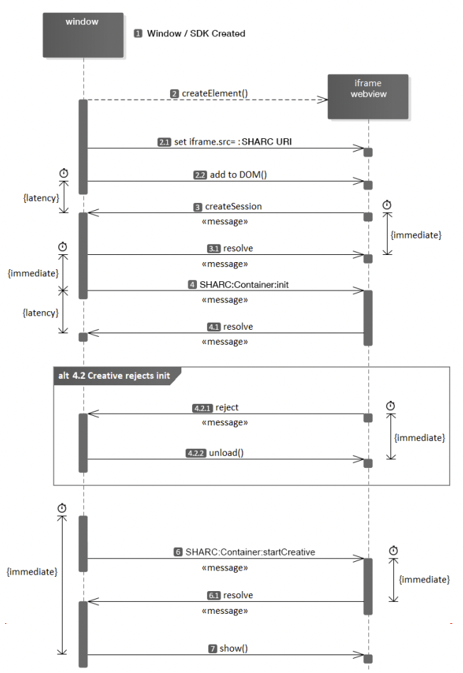

# SHARC POC

This is a proof of concept of SHARC (Secure HTML Ad Richmedia Container). A secure container API for managed
communication between an app or webpage and a served ad creative.

## Lifecycle


## Structure

```
├── creatives
│   ├── video-creative.html
│   └── video-creative.js
├── sharc-protocol.js
├── template.html
└── template.js
```
This poc follows the lifecycle provided above: 
- Open `template.html` in your browser and click on the `Init Ad` button 
- Then the template will be in charge of creating a secure iFrame and listen for the protocol message `CREATE_SESSION`
- In the `video-creative.html` once the video is ready to play and buffering is complete the creative creates a new SHARC session
- The `template` is now aware that a new session has been created, then it sends details about environment, settings, etc. to the `video creative`
- Then the `video creative` receives container details, prepare the video options and responds with ready details
- Once we reach this this point it means that both `template/video-creative` have said they’re ready to
go and everything is in place.
- Video starts
